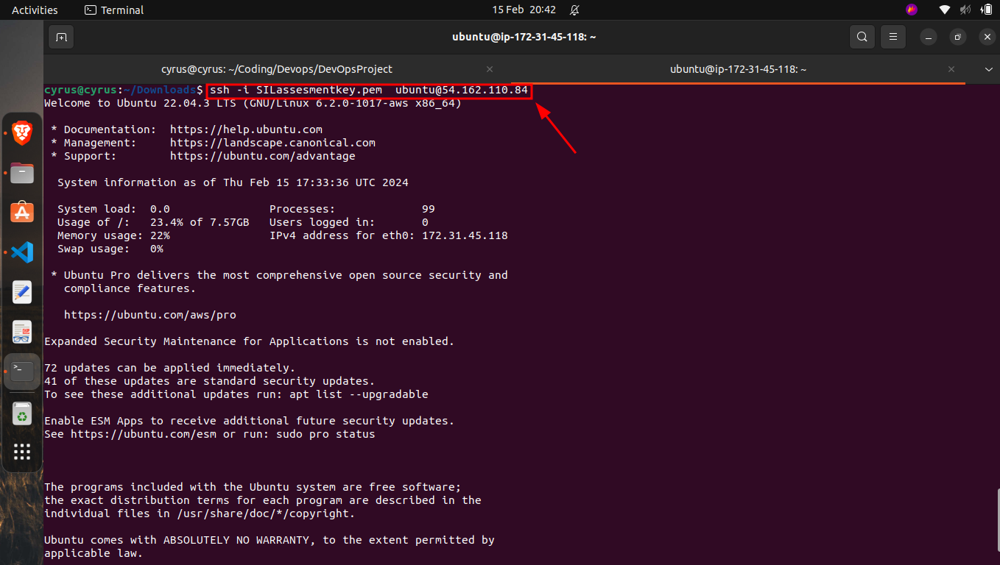
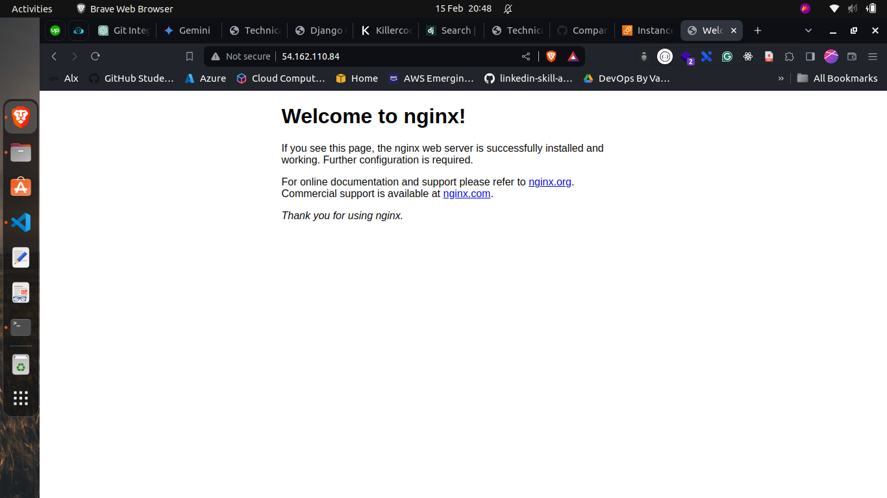

# Devops Assessment Project
This project is a simple web application that displays a list of items and allows the user to add new items to the list. The application is written in Python using the Django web framework. 

# Task 1: Version Control Integration
Under task 1, I have integrated the project with a version control system. I have used Git as the version control system and have created a repository on GitHub to store the project. The project is a simple web application that displays a list of items and allows the user to add new items to the list and perform all other CRUD operations. The database used is SQLite.

# Task 2: Containerization with Docker
In task 2, I have containerized the project using Docker. I have created a Dockerfile to build the image and also docker container to run the application. 
### Example
```bash
docker build -t devops-assessment .
```
This command will build the image of the application. 
Also you have to be in the same directory where the Dockerfile is located. 

```bash
docker run --name devops-assessment -p 8000:8000 devops-assessment
```
This command will run the application in a container.

Now you can access the application on http://127.0.0.1:8000/

# Task 3: Cloud Infrastructure (Cloud Engineering)
In task 3, I have deployed a virtual machine on AWS EC2, specifically an Ubuntu 20.04 instance. I created a key pair to access the instance using SSH. I created a security group to allow traffic on port 80, 22, and 443.
 
I also included a user data script to install Nginx on the instance.
```bash
#!/bin/bash
apt update -y

apt install nginx -y

systemctl start nginx

systemctl enable nginx

```

Using key pair, I accessed the instance using SSH 



The nginx is installed and running on the instance, and I can access the default page of nginx on the public IP of the instance.


