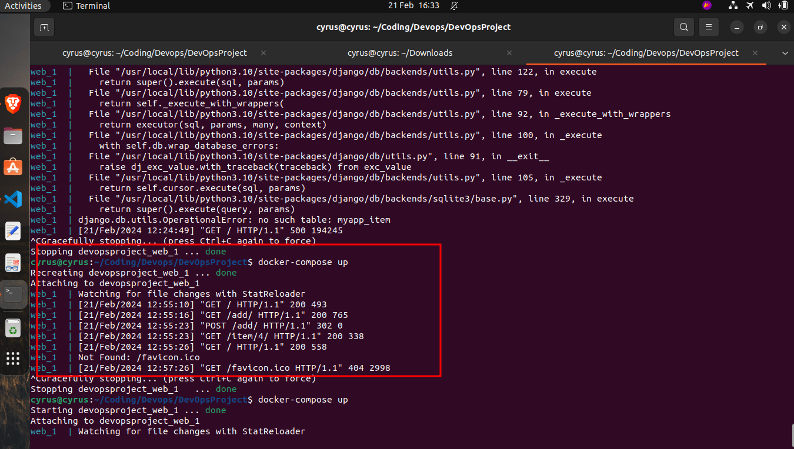
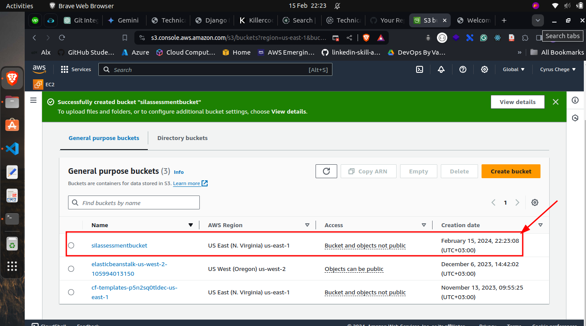
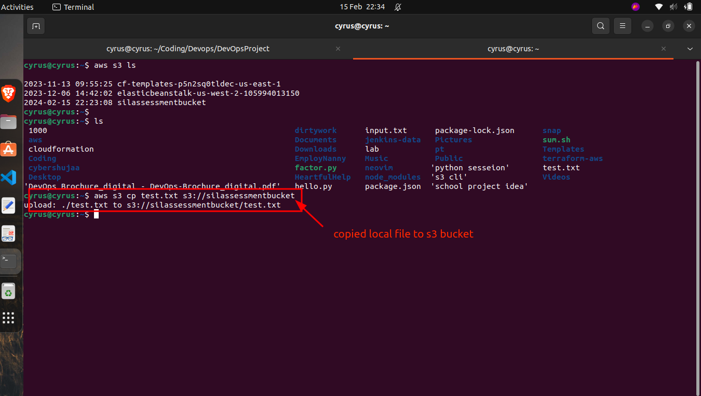
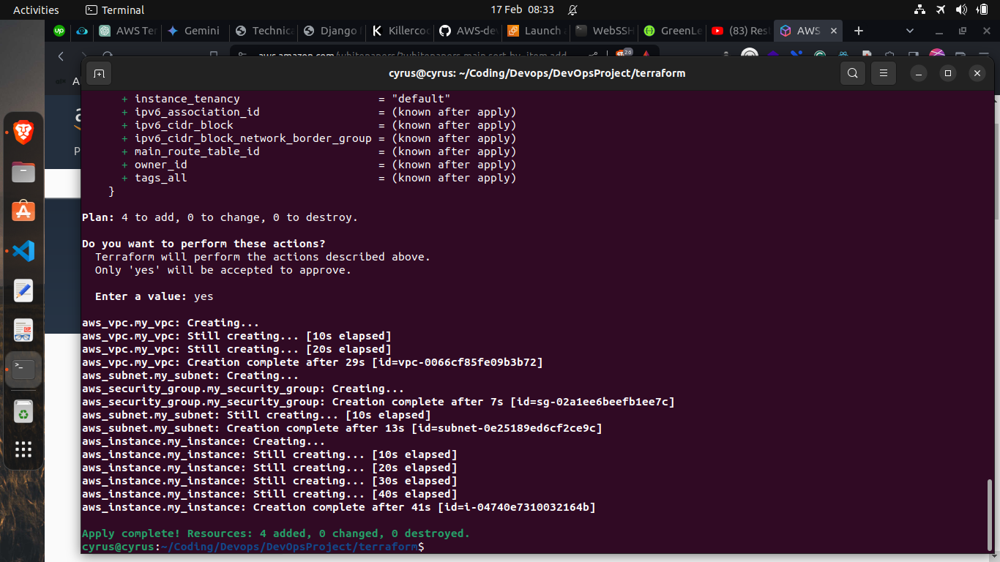
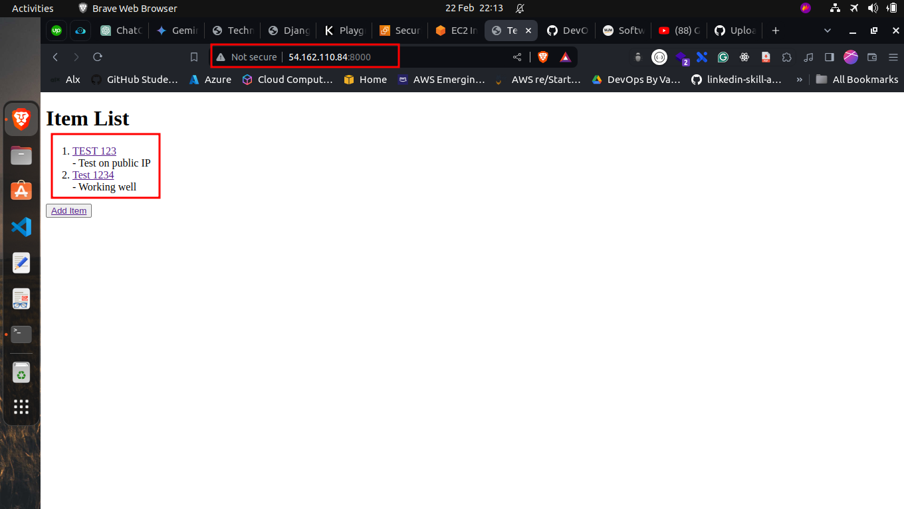

# Devops Assessment Project
This project is a simple web application that displays a list of items and allows the user to add new items to the list. The application is written in Python using the Django web framework. 

# Task 1: Version Control Integration
Under task 1, I have integrated the project with a version control system. I have used Git as the version control system and have created a repository on GitHub to store the project. The project is a simple web application that displays a list of items and allows the user to add new items to the list and perform all other CRUD operations. The database used is SQLite.

# Task 2: Containerization with Docker
In task 2, I have containerized the project using Docker and Docker Compose. I have created a Dockerfile to build the image and a docker-compose.yml file to define the services. The Dockerfile and docker-compose.yml file are in the root directory of the project. To build the image and run the container, you have to have Docker and Docker Compose installed on your machine. Also, you have to have the project cloned to your machine and include .env file in the root directory of the project. The .env file example is in the .env.example file. You have to replace the values with your own values.

To build the image, run the following command in the root directory of the project.
```bash
docker-compose build
```
To run the container, run the following command in the root directory of the project.
```bash
docker-compose up
```

# Task 3: Cloud Infrastructure (Cloud Engineering)
In task 3, I have deployed a virtual machine on AWS EC2, specifically an Ubuntu 20.04 instance. I created a key pair to access the instance using SSH. I created a security group to allow traffic on port 80, 22, and 443.
 
I also included a user data script to install Nginx on the instance.
```bash
#!/bin/bash
apt update -y

apt install nginx -y

systemctl start nginx

systemctl enable nginx

```

Using key pair, I accessed the instance using SSH 


The nginx is installed and running on the instance, and I can access the default page of nginx on the public IP of the instance.


# Task 4: Cloud Storage and Networking (Cloud Engineering)
In task 4, I have created an S3 bucket on AWS using the AWS Management Console. 



Using the AWS CLI(Which has to be installed and configured using AWS credentials), I uploaded a file to the S3 bucket. 



I also set up access permissions on the S3 bucket by editing the bucket policy to allow public access to the objects in the bucket.
The bucket policy is as follows:
```json
{
    "Version": "2012-10-17",
    "Statement": [
        {
            "Sid": "PublicReadGetObject",
            "Effect": "Allow",
            "Principal": "*",
            "Action": "s3:GetObject",
            "Resource": "arn:aws:s3:::silassessmentbucket/*"
        }
    ]
}
```
` arn:aws:s3:::silassessmentbucket` is the ARN of the bucket.

Using AWS CLI, I was able to retrieve the file from the S3 bucket.

```bash
aws s3 cp s3://silassessmentbucket/  test.txt
```

# Task 5: Infrastructure as Code (IaC) (DevOps and Cloud Engineering)
In task 5, I have created an infrastructure as code using Terraform to deploy an EC2, VPC and define security groups.

To run the terraform code, you have to have terraform installed on your machine and also have AWS CLI installed and configured with your credentials.

The terraform code is in the `terraform` directory.
```bash
cd terraform
```
```bash
terraform init
```
```bash
terraform apply
```
This will create the infrastructure on AWS.


# Task 6: CI/CD Pipeline with Cloud Integration
In task 6, I have created a CI/CD pipeline using GitHub Actions. The pipeline is triggered on every push to the main branch. The code is in the `.github/workflows/asessment.yaml` file. It automatically triggers the pipeline on every push to the main branch.

The following steps are performed in the pipeline:
- Checkout the code
- SSH into the EC2 instance
- Git pull the latest code from the repository
- Run the Docker Compose file to build the image and run the container

Now, the simple web application is deployed on the EC2 instance and can be accessed using the public IP of the instance. (For tesing, I added port 8000 to the security group of the instance to allow traffic on port 8000)




# Task 7: Site Reliability Engineering
In task 7, I have created a simple monitoring system using Prometheus and Grafana. I have used Docker to run Prometheus and Grafana containers. The configuration files for Prometheus and Grafana are in the `prometheus.yml`. The `docker-compose.yml` file is in the root directory of the project.

To run the monitoring system, you have to have Docker and Docker Compose installed on your machine.
Run the following command in the root directory of the project.
```bash
docker-compose up
```
This will start the Prometheus and Grafana containers. You can access the Prometheus dashboard on `http://localhost:9090` and the Grafana dashboard on `http://localhost:3000`. The default username and password for Grafana is `admin` and `admin`.

From the Prometheus dashboard, you can monitor the targets and the metrics.